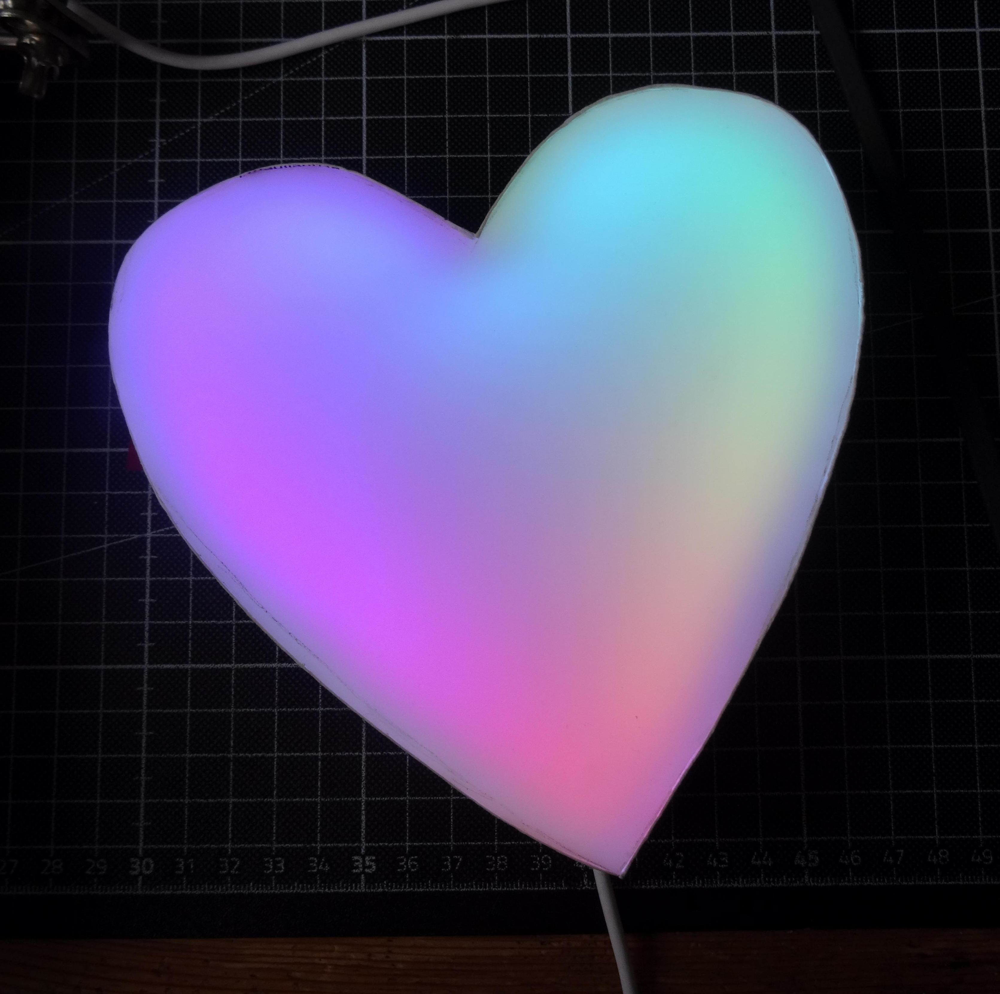

# Heart-Light


In this repo you can find the source for a [MicroPython](https://micropython.org/) based WS2812b-Project.
The microprozessor running it is the ESP32 (NodeMCU32S to be specific).
It also has a bmp280 termperature/pressure sensor and 2 pushbuttons for switching the animation.


Besides the buttons it can also be controlled via the MQTT. 
It implements the [homie](https://homieiot.github.io/) convention (functionality provided by the [microhomie](https://github.com/microhomie/microhomie) library).


## Build and use
The case is made from cardboard and put together with loads of hot glue, which look ok, but you can 3D-Print something as well.
All LEDs are glued to the walls and the ESP32 on the back. 
The light diffuser used on the picture is a acrylic sheet but i found white paper to work as well here.

If you have problems while building this and want help, feel free to open up an issue here :)

I use this with [OpenHAB](http://www.openhab.org/) and it works wonderfully.

## Flashing
Download the MicroPython [binary for the ESP32](https://micropython.org/download/esp32/).

On Linux it can be then be flashed via:
```
esptool.py --chip esp32 erase_flash ;
esptool.py --chip esp32 --port /dev/ttyUSB0 write_flash -z 0x1000  "$(find ~/ -name 'esp32*.bin' | head -n1)"
```
Edit the `settings.py` to your liking and put your wifi credentials (seperated by simple newlines) into a file called `wifi-credentials` on the root of the MicroPython filesystem.
Then upload all the `.py` files and the credentials with [rshell](https://github.com/dhylands/rshell) or [mpfshell](https://github.com/wendlers/mpfshell) for example.

